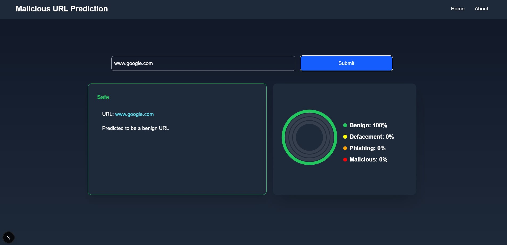

# Malicious URL Prediction Web App

This is a web-based application for predicting whether a given URL is malicious or benign. The frontend is built using **Next.js**, and the backend is powered by a **Python machine learning model** using **Random Forest** and **Logistic Regression**.

## Features
- **User-friendly Interface:** Allows users to input URLs and receive predictions.
- **Machine Learning Models:** Utilizes Random Forest and Logistic Regression for classification.
- **Real-time Prediction:** Provides instant feedback on the submitted URL.
- **Visualizations:** Displays model performance and data distribution.


### User Interface




### Prediction Result
```md

```

## Model Performance
Below are the evaluation metrics and performance comparisons of the models:

### Accuracy Comparison
```md

```

### Confusion Matrix
```md

```

### ROC Curve
```md

```

## Data Distribution
The dataset consists of **92,000** URLs categorized into different types such as phishing, benign, and defacement.

### URL Types Distribution
```md

```


## Installation and Setup
### Prerequisites
```sh
- Node.js
- Python 3.x
- Next.js
- Required Python libraries: pandas, numpy, sklearn, flask, matplotlib
```

### Setup
```sh
# Clone the repository
git clone https://github.com/yourusername/malicious-url-predictor.git
cd malicious-url-predictor
```

#### Backend Setup (Python ML API)
```sh
cd backend
pip install -r requirements.txt
python app.py
```

#### Frontend Setup (Next.js)
```sh
cd frontend
npm install
npm run dev
```

#### Access the Application
```sh
Open http://localhost:3000 in your browser.
```

## API Endpoints
```sh
- POST /predict - Accepts a URL and returns the prediction result.
```

## Technologies Used
```sh
- Frontend: Next.js, React
- Backend: Flask (Python)
- Machine Learning: Scikit-learn (Random Forest, Logistic Regression)
- Data Visualization: Matplotlib, Seaborn
```

## Contributors
```md
- Your Name - [GitHub](https://github.com/yourusername)
```

## License
```md
This project is licensed under the MIT License.
```

