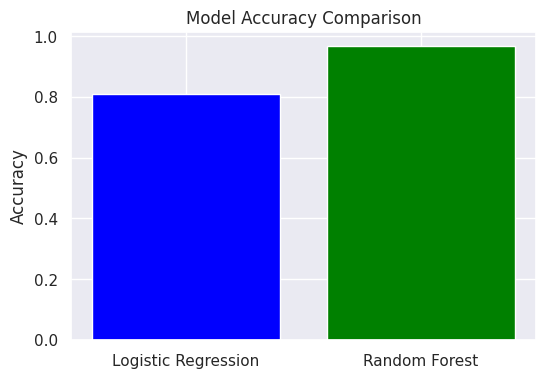
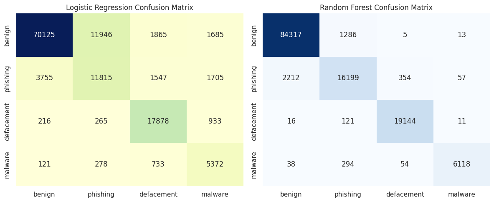
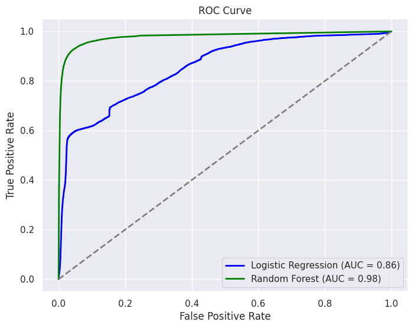
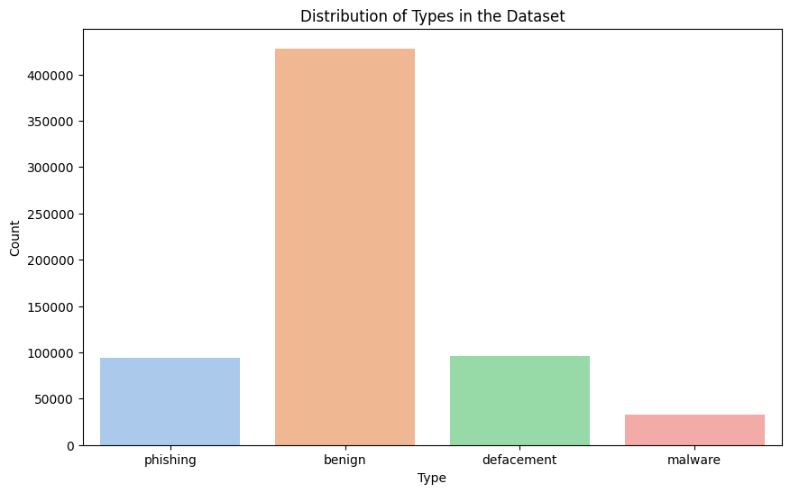
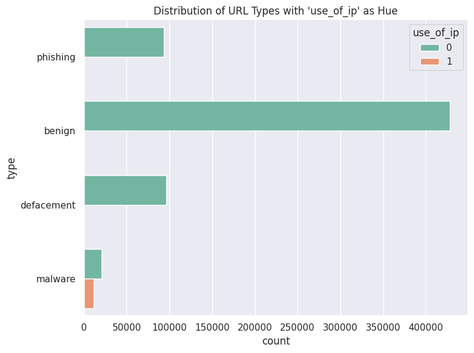

# Malicious URL Prediction Web App

This is a web-based application for predicting whether a given URL is malicious or benign. The frontend is built using **Next.js**, and the backend is powered by a **Python machine learning model** using **Random Forest** and **Logistic Regression**.

## Features
- **User-friendly Interface:** Allows users to input URLs and receive predictions.
- **Machine Learning Models:** Utilizes Random Forest and Logistic Regression for classification.
- **Real-time Prediction:** Provides instant feedback on the submitted URL.
- **Visualizations:** Displays model performance and data distribution.

### User Interface

 
  


### Prediction Result


## Model Performance
Below are the evaluation metrics and performance comparisons of the models:

### Accuracy Comparison



### Confusion Matrix



### ROC Curve



## Data Distribution
The dataset consists of **92,000** URLs categorized into different types such as phishing, benign, and defacement. The models are trained using this dataset.

### Dataset

You can access the dataset used for training the models at the following link:

[Dataset Link](https://example.com/dataset)  

### URL Types Distribution



### URL Distribution



## Installation and Setup

### Prerequisites
```sh
- Node.js
- Python 3.x
- Next.js
- Required Python libraries: pandas, numpy, sklearn, flask, matplotlib
```

### Setup
```sh

# Backend Setup (Python ML API)
cd backend
pip install -r requirements.txt
python app.py

# Frontend Setup (Next.js)
cd frontend
npm install
npm run dev

# Access the Application
Open http://localhost:3000 in your browser.
```

## API Endpoints
```sh
- POST /predict - Accepts a URL and returns the prediction result.
```

## Technologies Used
```sh
- Frontend: Next.js, React
- Backend: Flask (Python)
- Machine Learning: Scikit-learn (Random Forest, Logistic Regression)
- Data Visualization: Matplotlib, Seaborn
```

## Training the Model
The models used in the backend (Random Forest and Logistic Regression) are trained using the dataset linked above. The training process and model evaluation are available in the following Jupyter notebook:

[Model Training Notebook](https://github.com/Sithija-R/Malicious_URL_prediction/blob/main/ML%20model/malicious_URL_Prediction.ipynb) 

